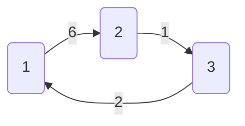
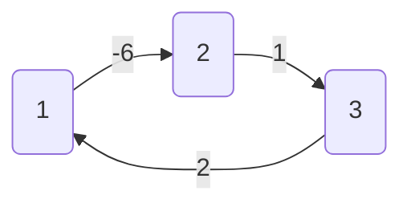

# 所有顶点对间的最短路径问题（Floyd算法）
Floyd算法又称为弗洛伊德算法，插点法，是一种用于寻找给定的加权图中顶点间最短路径的算法。简称Floyed(弗洛伊德)算法，是最简单的最短路径算法，可以计算图中任意两点间的最短路径。

Floyd的时间复杂度是$O (N^3)$，适用于出现负边权的情况。

## 算法的基本思想：
开始时，以任意两个顶点之间的有向边的权值作为路径长度，没有有向边时，路径长度为∞
以后逐步尝试在原路径中加入其它顶点作为中间顶点，如果增加中间顶点后，得到的路径比原来的路径长度减少了，则以此新路径代替原路径，修改矩阵元素。

## 算法描述：
二维数组存储最短路径，如果要求输出任意两个顶点间的最短路径，经过的顶点也要输出的话，根据题目要求可定义成三维数组存储路径经过的顶点，再进行适当的算法后对这两个数组进行输出即可

1. 初始化：点u、v如果有边相连，则`dis[u][v]=w[u][v]`。
如果不相连则`memset(dis,INT_MAX,sizeof(dis))`

    ```c++
    for(int k=1;k<=n;k++) //k必须在外层
        for(int i=1;i<=n;i++)
            for(int j=1;j<=n;j++)       
                if(dis[i][j]>dis[i][k]+dis[k][j])
                    dis[i][j]=dis[i][k]+dis[k][j];
    ```

2. 算法结束：dis即为所有点对的最短路径矩阵  

## 算法分析&思想讲解：

三层循环，第一层循环中间点k，第二第三层循环起点终点i、j
算法的思想很容易理解：如果点i到点k的距离加上点k到点j的距离小于原先点i到点j的距离，那么就用这个更短的路径长度来更新原先点i到点j的距离。

在下图中，因为`dis[1][3]+dis[3][2]<dis[1][2]`，所以就用`dis[1][3]+dis[3][2]`来更新原先1到2的距离。

我们在初始化时，把不相连的点之间的距离设为一个很大的数，不妨可以看作这两点相隔很远很远，如果两者之间有最短路径的话，就会更新成最短路径的长度。
Floyed算法的时间复杂度是$O(N^3)$ 。



## Floyed算法优缺点分析

Floyd算法适用于APSP(All Pairs Shortest Paths)，是一种动态规划算法，稠密图效果最佳，边权可正可负,适用于解决所有顶点对间的最短路径问题。此算法简单有效，由于三重循环结构紧凑，对于稠密图，效率要高于执行$V$次DijkStra算法。
注意同坐标求长度的公式（三角形勾股定理）
但不能解决带有“负权环路”（或者叫“负权环”）的图。如下图：



**优点**：容易理解，可以算出任意两个节点之间的最短距离，代码编写简单； 

**缺点**：时间复杂度比较高，不适合计算大量数据。


