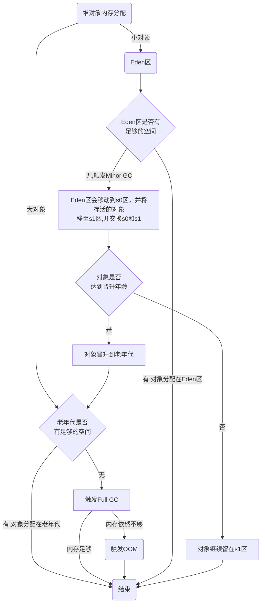

# Java 内存区域

**JDK1.7以前的内存区域**

**JDK1.8以后的内存区域**

**程序计数器**

- 线程私有
- 记录当前线程执行的字节码的行号
- 如果是Java方法，计数器记录的是字节码的行号
- 如果是Native方法，计数器值为空
- 如果是多线程，每个线程都有一个独立的计数器

**虚拟机栈**

- 线程私有
- 每个方法执行的时候都会创建一个栈帧
- 每个栈帧包含局部变量表、操作数栈、动态链接、方法出口等信息（类似于C语言中的栈）

**本地方法栈**
虚拟机栈为虚拟机执行 Java 方法 （也就是字节码）服务，而本地方法栈则为虚拟机使用到的 Native 方法服务。 

**堆**
此内存区域的唯一目的就是存放对象实例，几乎所有的对象实例以及数组都在这里分配内存。

Java 堆是垃圾收集器管理的主要区域，因此也被称作 GC 堆（Garbage Collected Heap）。从垃圾回收的角度，由于现在收集器基本都采用分代垃圾收集算法，所以 Java 堆还可以细分为：新生代和老年代；再细致一点有：Eden、Survivor、Old 等空间。进一步划分的目的是更好地回收内存，或者更快地分配内存。

****
- **新生代**：新创建的对象首先会被分配到新生代的 Eden 区，当 Eden 区满时，会触发 Minor GC，将 Eden 区中的存活对象复制到 S0 或 S1 中，然后清理掉 Eden 区中的所有对象。在多次 Minor GC 之后，存活时间较长的对象会被移动到老年代。
- **老年代**：存放新生代中经历多次 GC 仍然存活的对象。在老年代中，由于对象存活时间较长，所以很少发生 GC，当老年代满时，会触发 Major GC，进行老年代的内存清理。
- **永久代**：用于存放 Class 的元数据，JDK1.8 之后被元空间（Metaspace）取代。

**方法区**
方法区属于是 JVM 运行时数据区域的一块逻辑区域，是各个线程共享的内存区域。

当虚拟机要使用一个类时，它需要读取并解析 Class 文件获取相关信息，再将信息存入到方法区。方法区会存储已被虚拟机加载的 类信息、字段信息、方法信息、常量、静态变量、即时编译器编译后的代码缓存等数据。

**方法区和永久代以及元空间是什么关系呢？**
方法区和永久代以及元空间的关系很像 Java 中接口和类的关系，类实现了接口，这里的类就可以看作是永久代和元空间，接口可以看作是方法区，也就是说永久代以及元空间是 HotSpot 虚拟机对虚拟机规范中方法区的两种实现方式。并且，永久代是 JDK 1.8 之前的方法区实现，JDK 1.8 及以后方法区的实现变成了元空间。

**运行时常量池**
运行时常量池是方法区的一部分，用于存放编译期生成的各种字面量和符号引用。这部分内容将在类加载后进入方法区的运行时常量池中存放。

**字符串常量池**
字符串常量池是运行时常量池的一部分，用于存放编译期生成的各种字面量和符号引用。这部分内容将在类加载后进入方法区的运行时常量池中存放。

**直接内存**
直接内存并不是虚拟机运行时数据区的一部分，也不是 Java 虚拟机规范中定义的内存区域。在 JDK 1.4 中新加入了 NIO 类，引入了一种基于通道与缓冲区的 I/O 方式，它可以使用 Native 函数库直接分配堆外内存，然后通过一个存储在 Java 堆中的 DirectByteBuffer 对象作为这块内存的引用进行操作。这样能在一些场景中显著提高性能，因为避免了在 Java 堆和 Native 堆中来回复制数据。

# 垃圾回收算法

## 内存分配与回收策略

**对象优先在 Eden 区分配**
大多数情况下，对象在新生代中 Eden 区分配。当 Eden 区没有足够空间进行分配时，虚拟机将发起一次 Minor GC。

**大对象直接进入老年代**
大对象直接进入老年代的行为是由虚拟机动态决定的，它与具体使用的垃圾回收器和相关参数有关。大对象直接进入老年代是一种优化策略，旨在避免将大对象放入新生代，从而减少新生代的垃圾回收频率和成本。

**长期存活的对象将进入老年代**
既然虚拟机采用了分代收集的思想来管理内存，那么内存回收时就必须能识别哪些对象应放在新生代，哪些对象应放在老年代中。为了做到这一点，虚拟机给每个对象一个对象年龄（Age）计数器。大部分情况，对象都会首先在 Eden 区域分配。如果对象在 Eden 出生并经过第一次 Minor GC 后仍然能够存活，并且能被 Survivor 容纳的话，将被移动到 Survivor 空间（s0 或者 s1）中，并将对象年龄设为 1(Eden 区->Survivor 区后对象的初始年龄变为 1)。对象在 Survivor 中每熬过一次 MinorGC,年龄就增加 1 岁，当它的年龄增加到一定程度（默认为 15 岁），就会被晋升到老年代中。对象晋升到老年代的年龄阈值，可以通过参数 -XX:MaxTenuringThreshold 来设置。

**主要进行gc的区域**

部分收集 (Partial GC)
- 新生代收集（Minor GC / Young GC）：只对新生代进行垃圾收集；
- 老年代收集（Major GC / Old GC）：只对老年代进行垃圾收集。需要注意的是 Major GC 在有的语境中也用于指代整堆收集；
- 混合收集（Mixed GC）：对整个新生代和部分老年代进行垃圾收集
整堆收集 (Full GC)：收集整个 Java 堆和方法区

**空间分配担保**
空间分配担保是为了确保在 Minor GC 之前老年代本身还有容纳新生代所有对象的剩余空间。

## Eden区、s0，s1区关系和对象生成流程

新创建一个对象，首先判断能否放到Eden区，如果Eden区满了，会触发mirror gc。此时Eden区和s0区中存活的对象移至s1区，并标志对象的分代年龄，eden区和s0区清空，如果此时对象还无法放置eden区，则直接放置老年代。反之亦然。

## 死亡对象判断方法

### 引用计数法

引用计数法是通过引用计数器来判断对象是否存活。每个对象都有一个引用计数器，当有一个地方引用它时，计数器加 1；当引用失效时，计数器减 1。当计数器为 0 时，说明对象不再被引用，可以被回收。

但是引用计数法有一个很大的问题，就是循环引用。循环引用是指两个对象相互引用，但是没有其他对象引用它们。这样的话，引用计数器永远不会为 0，导致对象永远不会被回收。

### 可达性分析法

可达性分析法是通过一系列的称为“GC Roots”的对象作为起始点，从这些节点开始向下搜索，搜索所走过的路径称为引用链，当一个对象到 GC Roots 没有任何引用链相连时，则证明此对象是不可用的。

GC Roots 对象包括：
- 虚拟机栈中引用的对象
- 方法区中类静态属性引用的对象
- 方法区中常量引用的对象
- 本地方法栈中 JNI（即 Native 方法）引用的对象
- Java 虚拟机内部的引用

### 引用类型

- 强引用：只要强引用存在，垃圾收集器永远不会回收被引用的对象。
- 软引用：只有在内存不足的情况下，垃圾收集器才会回收被软引用关联的对象。
- 弱引用：只要垃圾收集器工作，不管内存是否充足，都会回收被弱引用关联的对象。
- 虚引用：用来跟踪对象被垃圾回收器回收的活动。

### 如何判断一个常量是废弃常量

- JDK1.7 之前运行时常量池逻辑包含字符串常量池存放在方法区, 此时 hotspot 虚拟机对方法区的实现为永久代
- JDK1.7 字符串常量池被从方法区拿到了堆中, 这里没有提到运行时常量池,也就是说字符串常量池被单独拿到堆,运行时常量池剩下的东西还在方法区, 也就是 hotspot 中的永久代 。
- JDK1.8 hotspot 移除了永久代用元空间(Metaspace)取而代之, 这时候字符串常量池还在堆, 运行时常量池还在方法区, 只不过方法区的实现从永久代变成了元空间(Metaspace)

