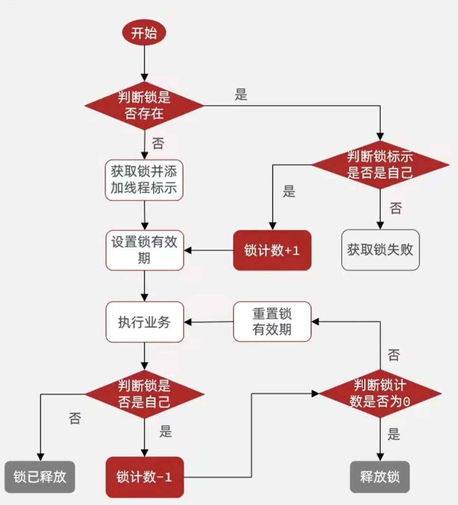
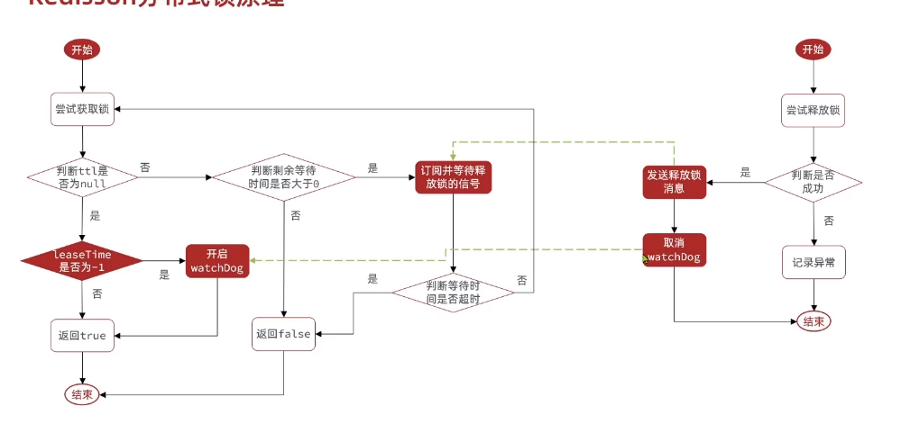

# Redis中利用setnx实现的分布式锁存在以下问题

**重入问题** 重入问题是指 获得锁的线程可以再次进入到相同的锁的代码块中，可重入锁的意义在于防止死锁，比如HashTable这样的代码中，他的方法都是使用synchronized修饰的，假如他在一个方法内，调用另一个方法，那么此时如果是不可重入的，不就死锁了吗？所以可重入锁他的主要意义是防止死锁，我们的synchronized和Lock锁都是可重入的。

**不可重试** 是指目前的分布式只能尝试一次，我们认为合理的情况是：当线程在获得锁失败后，他应该能再次尝试获得锁。

**超时释放** 我们在加锁时增加了过期时间，这样的我们可以防止死锁，但是如果卡顿的时间超长，虽然我们采用了lua表达式防止删锁的时候，误删别人的锁，但是毕竟没有锁住，有安全隐患

**主从一致性** 如果Redis提供了主从集群，当我们向集群写数据时，主机需要异步的将数据同步给从机，而万一在同步过去之前，主机宕机了，就会出现死锁问题。

Redisson是一个在Redis的基础上实现的Java驻内存数据网格（In-Memory Data Grid）。它不仅提供了一系列的分布式的Java常用对象，还提供了许多分布式服务，其中就包含了各种分布式锁的实现。

而Redisson帮我们实现了分布式锁的相关功能

# Redisson可重入锁的原理

Redisson分布式锁中，他采用hash结构用来存储锁，其中大key表示表示这把锁是否存在，用小key表示当前这把锁被哪个线程持有，

# Redisson可重入锁的锁重试

# redisson多节点的解决

将redis各个节点分别拆成独立的节点，向所有节点设置锁，因此节点不会同时失效，参数锁问题。

## 红锁
### 简介
Redis中针对此种情况，引入了红锁的概念。红锁采用主节点过半机制，即获取锁或者释放锁成功的标志为：在过半的节点上操作成功。

### 原理
在Redis的分布式环境中，我们假设有N个Redis master。这些节点完全互相独立，不存在主从复制或者其他集群协调机制。之前我们已经描述了在Redis单实例下怎么安全地获取和释放锁。我们确保将在每（N）个实例上使用此方法获取和释放锁。

# Redis可重入的锁总结

抢锁过程中，获得当前线程，通过tryAcquire进行抢锁，该抢锁逻辑和之前逻辑相同

1、先判断当前这把锁是否存在，如果不存在，插入一把锁，返回null

2、判断当前这把锁是否是属于当前线程，如果是，则返回null

所以如果返回是null，则代表着当前这哥们已经抢锁完毕，或者可重入完毕，但是如果以上两个条件都不满足，则进入到第三个条件，返回的是锁的失效时间，同学们可以自行往下翻一点点，你能发现有个while( true) 再次进行tryAcquire进行抢锁

如果是没有传入时间，则此时也会进行抢锁， 而且抢锁时间是默认看门狗时间 commandExecutor.getConnectionManager().getCfg().getLockWatchdogTimeout()

ttlRemainingFuture.onComplete((ttlRemaining, e) 这句话相当于对以上抢锁进行了监听，也就是说当上边抢锁完毕后，此方法会被调用，具体调用的逻辑就是去后台开启一个线程，进行续约逻辑，也就是看门狗线程

## 5.5 分布式锁-redission锁的MutiLock原理

为了提高redis的可用性，我们会搭建集群或者主从，现在以主从为例

此时我们去写命令，写在主机上， 主机会将数据同步给从机，但是假设在主机还没有来得及把数据写入到从机去的时候，此时主机宕机，哨兵会发现主机宕机，并且选举一个slave变成master，而此时新的master中实际上并没有锁信息，此时锁信息就已经丢掉了。

为了解决这个问题，redission提出来了MutiLock锁，使用这把锁咱们就不使用主从了，每个节点的地位都是一样的， 这把锁加锁的逻辑需要写入到每一个主丛节点上，只有所有的服务器都写入成功，此时才是加锁成功，假设现在某个节点挂了，那么他去获得锁的时候，只要有一个节点拿不到，都不能算是加锁成功，就保证了加锁的可靠性。

那么MutiLock 加锁原理是什么呢？笔者画了一幅图来说明

当我们去设置了多个锁时，redission会将多个锁添加到一个集合中，然后用while循环去不停去尝试拿锁，但是会有一个总共的加锁时间，这个时间是用需要加锁的个数 * 1500ms ，假设有3个锁，那么时间就是4500ms，假设在这4500ms内，所有的锁都加锁成功， 那么此时才算是加锁成功，如果在4500ms有线程加锁失败，则会再次去进行重试.

