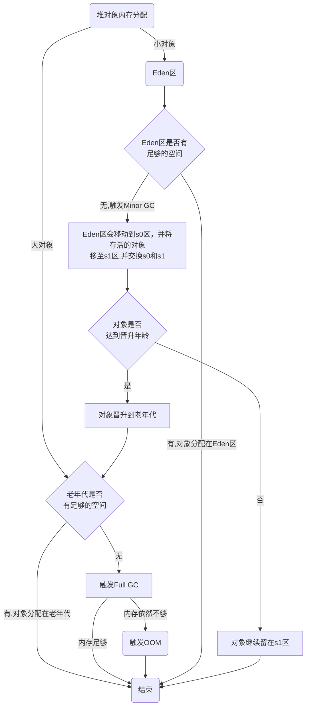

# 第一次面试-Opay

总之第一次面试答得不好，针对博客之前的内容印象不是很深刻，所以这里整理一下之前的内容，以便下次面试的时候能够更好的回答问题。
待整理

# 大致的问题合集

- Java中的集合有哪些
- 谈到双端队列，是什么，有什么使用场景
- 谈到阻塞队列，除了生产者消费者模型，还有什么场景
- InputStream和BufferInputStream的区别，有什么优点
- 谈到了多线程，可以用什么做线程间同步
- ThreadLocalMap的实现相关，怎么解决内存泄漏
- Syncronized关键字，锁升级策略
- JVM的内存模型
- JVM堆的结构
- 堆中创建对象的流程
- mybatis和mybatis-plus的区别
- 讲到Nacos的作用，除了nacos，还有什么服务发现中心
- Nacos和Euareka的优缺点
- 服务提供方和服务消费方是怎么通过服务发现中心进行通信的
- CAP理论有了解过吗

## Java中的集合有哪些

Java中的集合主要包括List、Set、Map和Queue等。其中，List是有序集合，可以存储重复元素；Set是无序集合，不允许存储重复元素；Map是键值对集合，每个键对应一个值；Queue是队列集合，用于存储元素并实现先进先出的操作。

**List**

- ArrayList：基于数组实现，支持随机访问和动态扩容。
- LinkedList：基于链表实现，支持快速插入和删除操作。

**Set**

- HashSet：基于哈希表实现，不保证元素的顺序。
- TreeSet：基于红黑树实现，保证元素的有序性。

**Map**
- HashMap：基于哈希表实现，不保证元素的顺序。
- TreeMap：基于红黑树实现，保证元素的有序性。
- LinkedHashMap：基于哈希表和双向链表实现，保证元素的插入顺序。
- ConcurrentHashMap：基于分段锁实现，支持高并发操作。

**Queue**
- ArrayDeque：基于数组实现，支持双端队列操作。
- PriorityQueue：基于堆实现，支持优先级队列操作。
- PriorityQueue: 基于堆实现，支持优先级队列操作。

**除了生产者消费者模型，阻塞队列还有什么场景**
（当时除了生产消费者忘了线程池了，估摸是想通过这个引导出线程池内容）

- 生产者消费者模型
- 线程池中的任务队列
- 事件驱动模型中的事件队列
- 消息队列中的消息队列

**双端队列有什么使用场景**

- 任务调度： 可以将任务按照优先级插入队列的头部或尾部，实现任务的优先级调度。
- 窗口滑动： 在滑动窗口算法中，双端队列可以用来维护窗口内的最大/最小值。
- Undo/Redo功能： 在应用程序中实现撤销和重做功能时，可以使用双端队列来管理操作历史。
- 实现线程安全队列： 在多线程环境下，使用ConcurrentLinkedDeque实现线程安全的双端队列。

## InputStream和BufferInputStream的区别

InputStream是Java中所有输入流的抽象基类，它定义了读取字节流的基本方法。BufferedInputStream是InputStream的子类，它提供了缓冲功能，可以提高读取字节流的性能。

**BufferInputStream的优缺点**

BufferedInputStream的优点是可以减少读取磁盘文件的次数，提高读取性能；缺点是会增加内存消耗，因为需要维护一个缓冲区，增加一定的内存消耗。

## ThreadLocal的实现

ThreadLocalMap是ThreadLocal的内部类，用于存储线程本地变量。ThreadLocalMap是一个自定义的哈希表，它的键是ThreadLocal对象，值是线程本地变量的值。每一个线程都有一个ThreadLocalMap对象，用于存储线程本地变量。

ThreadLocal存在内存泄漏的问题，ThreadLocalMap 中使用的 key 为 ThreadLocal 的弱引用，而 value 是强引用。所以，如果 ThreadLocal 没有被外部强引用的情况下，在垃圾回收的时候，key 会被清理掉，而 value 不会被清理掉。解决这个问题的方法是在使用完 ThreadLocal 后，调用 remove() 方法，手动清除 ThreadLocalMap 中的 key。

## Syncronized关键字
（这块没答好，刚开始没反应过来，后面锁升级部分忘了）

synchronized是Java中最基本的同步手段，它保证了线程的安全性，相较于volatile更加重量级。synchronized主要有三种用法：修饰实例方法、修饰静态方法、修饰同步方法块中的对象。

(面试的时候想通过这个引导出锁升级的内容，但是当时没看)
在Java6(1.6)之后，synchronized 引入了大量的优化如自旋锁、适应性自旋锁、锁消除、锁粗化、偏向锁、轻量级锁等技术来减少锁操作的开销.

**锁升级的过程**
1. 无锁状态：锁对象还没有被任何线程锁定，没有线程相互竞争，此时处于无锁状态。
2. 偏向锁状态：只有一个线程不停访问代码块，此时会使用偏向锁。(在JDK15后，偏向锁被废弃，因为撤销带来的性能开销大)
3. 轻量级锁状态：多个线程访问代码块，偏向锁会撤销，此时会使用轻量级锁。
4. 重量级锁状态：当CAS自旋达到一定次数没有拿到锁(有线程超过10次自旋，或者自旋线程数超过cpu核数的一半)，会撤销掉轻量级锁，此时会使用重量级锁。

**相较于volatile的区别**
- volatile主要用于修饰变量，而syschronized主要用于修饰方法和代码块；
- volatile相较于synchronized速度更快；
- volatile关键字是Java中的一种轻量级同步机制，它保证了线程的可见性，但是不保证原子性；
- synchronized关键字是Java中的一种重量级同步机制，它保证了线程的可见性和原子性，但是性能开销较大；
- volatile关键字一般使用乐观锁的思想实现，通常使用轻量级锁，使用CAS机制。
- synchronized关键字一般使用悲观锁的思想实现，通常有锁升级的过程。

## JVM的内存模型

**存放在线程中的**
- 程序计数器：记录当前线程执行的字节码的行号，是线程私有的。
- 虚拟机栈：每个方法执行的时候都会创建一个栈帧，包含局部变量表、操作数栈、动态链接、方法出口等信息，是线程私有的。
- 本地方法栈：用于存放 Native 方法的信息，是线程私有的。

**存放在堆中的**
- 堆：存放对象实例，是垃圾收集器管理的主要区域，包括新生代、老年代和永久代（JDK1.7之前），此外还有字符串常量池。
- 方法区: 存放类的元数据，包括类信息、字段信息、方法信息、常量、静态变量、即时编译器编译后的代码缓存等数据。1.8后被元空间取代，移动到本地内存中。

**存放在本地内存**
- 元空间：用于存放 Class 的元数据，JDK1.8 之后取代了永久代。
- 直接内存：用于存放堆外内存，通过 NIO 类库直接分配堆外内存、Native方法，提高性能。

## JVM堆的结构

堆区分为新生代、老年代和永久代（JDK1.7之前）或元空间（JDK1.8之后）。

新生代又分为Eden区、s0区，s1区，默认数据大小为8:1:1

## Eden区、s0，s1区关系和对象生成流程

新创建一个对象，首先判断能否放到Eden区，如果Eden区满了，会触发mirror gc。此时Eden区和s0区中存活的对象移至s1区，并标志对象的分代年龄，eden区和s0区清空，如果此时对象还无法放置eden区，则直接放置老年代。反之亦然。

## mybatis和mybatis-plus的区别

mybatis-plus是mybatis的增强版，它在mybatis的基础上提供了更多的功能和特性。mybatis-plus提供了代码生成器、分页插件、性能分析插件等功能，简化了开发过程，提高了开发效率。此外，mybatis-plus还提供了更加强大的CRUD操作，支持更多的数据库操作。

## 讲到Nacos和Euareka的优缺点

首先，从实现方式上看，Nacos和Eureka都支持服务注册与发现，但是它们的实现方式略有不同。Nacos基于客户端/服务器架构，服务提供者在启动时将自己注册到Nacos的服务注册表中，服务消费者从Nacos的服务注册表中获取服务列表。而Eureka则基于云原生架构，使用RESTful API进行通信，服务提供者将自己的信息注册到Eureka Server，服务消费者从Eureka Server获取服务列表。

其次，从功能上看，Nacos和Eureka都提供了动态服务发现、配置管理、服务元数据管理和流量管理等功能。然而，它们之间也存在一些差异。例如，Nacos支持服务端主动检测提供者状态，而Eureka则采用客户端检测机制。此外，Nacos支持服务列表变更的消息推送模式，服务列表更新更及时，而Eureka则采用拉取模式。

最后，从性能上看，Nacos和Eureka都具有较高的性能和可扩展性。然而，由于Nacos是基于长连接的，因此在处理大量并发请求时可能会表现出更高的性能。而Eureka则采用短连接和定时发送的方式，因此在处理少量请求时可能具有更好的性能。

## CAP理论

CAP理论是分布式系统设计中的一个重要理论，它指出在分布式系统中，**一致性（Consistency）**、**可用性（Availability）**和**分区容错性（Partition Tolerance）**这三个特性不可能同时满足。在分布式系统中，由于网络分区、节点故障等原因，分区容错性是必须保证的，因此在一致性和可用性之间需要进行权衡。

具体来说，CAP理论指出在分布式系统中，只能满足其中的两个特性，无法同时满足三个特性。例如，当网络分区发生时，系统需要保证分区容错性，此时需要选择一致性或可用性。如果选择一致性，则可能导致部分节点不可用；如果选择可用性，则可能导致数据不一致。因此，在设计分布式系统时，需要根据具体的业务需求和系统特性进行权衡，选择合适的一致性级别和可用性级别。