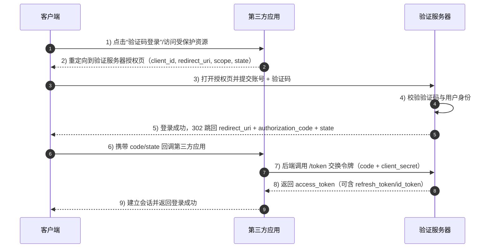

# 前言

众所周知，飞牛OS提供了一套系统搭建的OAuth服务，但是这套服务并不对外开放

# 登录处理流程

以飞牛影视处理

## OAuth协议处理

OAuth 2.0是一种授权框架，允许第三方应用程序在不获取用户凭证的情况下访问用户资源。以下是详细的处理流程：

整体流程可以参考SaToken项目所写的[OAuth2.0简析](https://sa-token.cc/doc.html#/oauth2/readme)

对于飞牛而言，主要采用的是授权码模式（Authorization Code Grant），Server 端向 Client 端下放 Code 码，Client 端再用 Code 码换取授权 Access-Token。

理论上来说，一般的OAuth登录登录链路是这样的。



# 飞牛的处理流程

一个在线测试常规OAuth2登录的网站 http://sspx-oauth2-client-h5.dev33.cn/


基于目前分析，将飞牛OS的OAuth登录流程主要有以下分析文本

OAuth2 Server 主机地址： 你的主机地址
OAuth2 Server 授权页地址：/signin
OAuth2 Server 获取 token 地址：/oauthapi/authorize
OAuth2 Server 刷新 token 地址： 
OAuth2 Server 获取 userinfo 地址：

飞牛影视的result 地址： /v/oauth/result

## 飞牛Nginx配置

飞牛的Nginx 反向代理位置在  cd /usr/trim/nginx/conf/
目录下，其中使用飞牛自己的官方应用会预先创建的相关的反向代理配置文件

大部分的请求会以unix socket 的方式转发到飞牛OS的各个应用服务

```nginx
location /v1/accountapi {
    proxy_pass http://unix:/var/run/trim.accountsrv.sock:;
}
location /oauthapi {
    proxy_pass http://unix:/var/run/trim.accountsrv.sock:;
}
```
例如上方OAuthAPI 的请求会被转发到 trim.accountsrv.sock 服务中处理

## 飞牛os数据库配置

通过上文有关OAuth基础的，一般来说类似于OAuth的会在服务端记录需要的应用，其中有应用id，密钥，回调地址等参数，很明显这个是存储在飞牛的数据库中。

进入飞牛系统的数据库，此处参考这篇文档，可以进入到飞牛os的数据库中

https://club.fnnas.com/forum.php?mod=viewthread&tid=27957

有关OAuth相关的内容，位于`trim.oauth_app`中，很明显当中添加了俩app（即影视和相册），上文中不知道从哪来的client_id也在这找到了对应的内容。


## 飞牛具体登录链路

### 1.点击NAS登录，跳转到登录页面
   
 URI: /signin?client_id=U1G8OGDF3Y&redirect_uri=http%3A%2F%2Fddns.liahnu.top%3A5666%2Fv%2Foauth%2Fresult 
 redirect_uri 是客户端指定的回调URI，用于接收授权码, 此处的回调地址为http://ddns.liahnu.top:5666/v/oauth/result 
 client_id 是客户端注册时获得的ID，用于标识客户端应用


### 2.用户在登录页面输入用户名密码，完成认证

获取存储的token和userName
如果存在token，自动触发登录流程，登录使用WebSocket进行登录。此处登录有两种方式，token和密码登录。

登录这块涉及到密钥加密一系列（懒得分析了），传入登录的账号密码。

最终完成登录后会返回token字段，并存储在cookie中（由于飞牛的第一方应用都是在同一个域名下，直接通过cookie共享这个token数据）


### 3. 登录成功，重定向到回调地址
这一步和传统的OAuth2登录不同，这里应该是拆成了两步进行

POST /oauthapi/authorize：浏览器提交授权/登录确认数据到授权服务器。
GET /v/oauth/result?code=...&state=undefined：授权服务器返回后，浏览器访问结果页并带上授权码。

authorize提交以下json

**入参**

从cookie中取出token，进行验证登录
```json
{
    "client_id":"U1G8OGDF3Y",
    "redirect_uri":"http://ddns.liahnu.top:5666/v/oauth/result",
    "response_type":"code",
    "state":"",
    "token":"token"
}
```

**出参**
```json
{"code":0,"msg":"success","data":{"redirect_uri":"http://ddns.liahnu.top:5666/v/oauth/result","code":"0wR117VN4Q"}}
```

从这里换到登录的code，进行下一步跳转到第三方应用登录。

http://ddns.liahnu.top:5666/v/oauth/result?code=230pV9s-5w&state=undefined

带上了授权码code=230pV9s-5w 和状态码state=undefined，请求后通过前端路由渲染返回网页

### 4. 客户端应用使用授权码请求访问令牌

http://ddns.liahnu.top:5666/v/api/v1/auth

POST /v/api/v1/auth 
**入参**
```json
{"source":"Trim-NAS","code":"wspXKEd05A"}
```

**成功回调**
```json
{"msg":"","code":0,"data":{"token":"4110c478503e46c4838ed69c0be79a8a"}}
```

从这换到了token参数，并把这个参数存储到cookie中，
Trim-MC-token：4110c478503e46c4838ed69c0be79a8a
