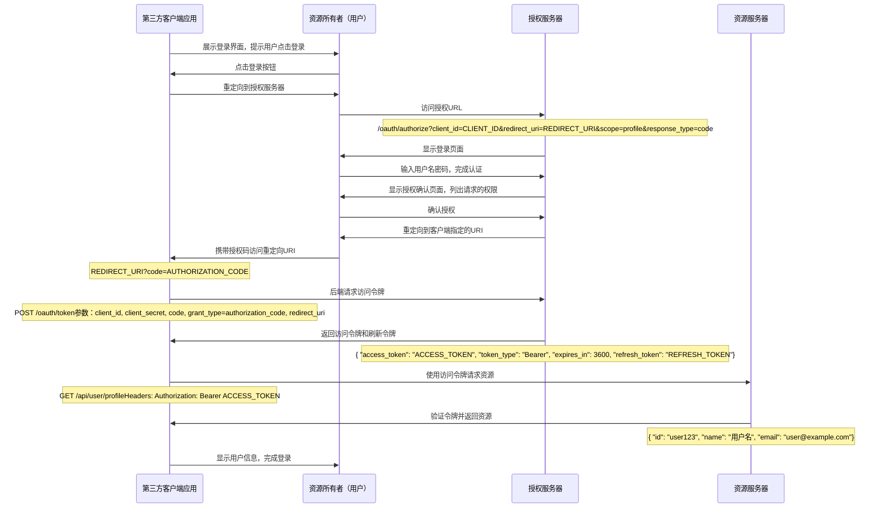

# 前言

众所周知，飞牛OS提供了一套系统搭建的OAuth服务，但是这套服务并不对外开放

# 登录处理流程

以飞牛影视处理

## OAuth协议处理

OAuth 2.0是一种授权框架，允许第三方应用程序在不获取用户凭证的情况下访问用户资源。以下是详细的处理流程：


## 飞牛的处理流程

### 1.点击NAS登录，跳转到登录页面
   
 URI: /signin?client_id=U1G8OGDF3Y&redirect_uri=http%3A%2F%2Fddns.liahnu.top%3A5666%2Fv%2Foauth%2Fresult 
 redirect_uri 是客户端指定的回调URI，用于接收授权码, 此处的回调地址为http://ddns.liahnu.top:5666/v/oauth/result 
 client_id 是客户端注册时获得的ID，用于标识客户端应用


### 2.用户在登录页面输入用户名密码，完成认证


登录后，请求该地址获取授权码
http://ddns.liahnu.top:5666/oauthapi/authorize

获取存储的token和userName
如果存在token，自动触发登录流程

**入参**
此处登录有两种方式，token和密码登录
token登录
```json
{
    "client_id":"U1G8OGDF3Y",
    "redirect_uri":"http://ddns.liahnu.top:5666/v/oauth/result",
    "response_type":"code",
    "state":"",
    "token":"token"
}
```


**出参**
```json
{"code":0,"msg":"success","data":{"redirect_uri":"http://ddns.liahnu.top:5666/v/oauth/result","code":"0wR117VN4Q"}}
```


### 3. 登录成功，重定向到回调地址
http://ddns.liahnu.top:5666/v/oauth/result?code=230pV9s-5w&state=undefined

带上了授权码code=230pV9s-5w 和状态码state=undefined

### 4. 客户端应用使用授权码请求访问令牌

http://ddns.liahnu.top:5666/v/api/v1/auth

POST /v/api/v1/auth 
**入参**
```json
{"source":"Trim-NAS","code":"wspXKEd05A"}
```

**成功回调**
```json
{"msg":"","code":0,"data":{"token":"4110c478503e46c4838ed69c0be79a8a"}}
```

从这换到了token参数，并把这个参数存储到cookie中，
Trim-MC-token：4110c478503e46c4838ed69c0be79a8a


